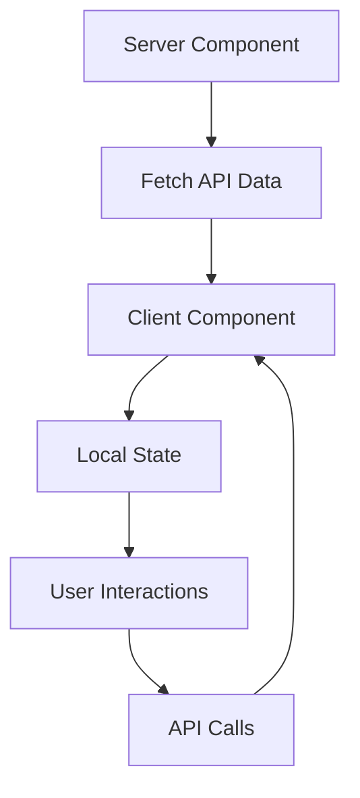

# 🌍 Countries Explorer - Where in the world?

Una aplicación moderna y responsiva para explorar países del mundo, construida con Next.js 15, TypeScript y Tailwind CSS.

## ✨ Características

- **🔍 Búsqueda Inteligente**: Busca países por nombre, capital o región con debounce automático
- **🏷️ Filtros por Región**: Filtra países por África, América, Asia, Europa y Oceanía
- **🌓 Modo Oscuro/Claro**: Soporte completo para temas con persistencia
- **📱 Diseño Responsivo**: Optimizado para móviles, tablets y desktop
- **⚡ Alto Rendimiento**: Server Components, caché inteligente y generación estática
- **♿ Accesibilidad**: Cumple con estándares WCAG 2.1
- **🎭 Animaciones Fluidas**: Transiciones suaves con Framer Motion
- **🧪 Pruebas Unitarias**: Suite completa de testing con Jest y React Testing Library


## 🛠️ Stack Tecnológico

- **Framework**: Next.js 15 (App Router)
- **Lenguaje**: TypeScript
- **Estilos**: Tailwind CSS
- **Gestión de Estado**: React Hooks + Context
- **Animaciones**: Framer Motion
- **Temas**: next-themes
- **Iconos**: Lucide React
- **Testing**: Jest + React Testing Library
- **API**: REST Countries API

## 📁 Estructura del Proyecto

```
├── app/                          # App Router de Next.js 15
│   ├── country/[code]/
│   │   └── page.tsx             # Página de detalle del país
│   ├── globals.css              # Estilos globales y variables CSS
│   ├── layout.tsx               # Layout principal con providers
│   └── page.tsx                 # Página home (Server Component)
├── components/                   # Componentes reutilizables
│   ├── layout/
│   │   └── header.tsx           # Header con navegación y toggle de tema
│   ├── pages/
│   │   ├── country-detail.tsx   # Componente de detalle del país
│   │   └── home-page.tsx        # Componente principal (Client Component)
│   ├── providers/
│   │   └── theme-provider.tsx   # Proveedor de tema
│   └── ui/
│       ├── countries-grid.tsx   # Grid responsivo de países
│       ├── country-card.tsx     # Tarjeta individual de país
│       ├── search-and-filter.tsx # Búsqueda y filtros
│       └── theme-toggle.tsx     # Toggle de tema oscuro/claro
├── lib/
│   └── api/
│       └── countries.ts         # Servicio API con caché y helpers
├── types/
│   └── country.ts               # Tipos TypeScript para países
├── __tests__/                   # Pruebas unitarias
│   └── components/
└── public/                      # Archivos estáticos
```

## 🏗️ Instalación y Configuración

### Prerrequisitos

- Node.js 18+
- npm, yarn o pnpm

### Pasos de Instalación

1. **Clonar el repositorio**

   ```bash
   git clone https://github.com/tu-usuario/countries-explorer.git
   cd countries-explorer
   ```

2. **Instalar dependencias**

   ```bash
   npm install
   # o
   yarn install
   # o
   pnpm install
   ```

3. **Ejecutar en desarrollo**

```bash
npm run dev
   # o
yarn dev
   # o
pnpm dev
```

4. **Abrir en el navegador**

   Visita [http://localhost:3000](http://localhost:3000)

### Comandos Disponibles

```bash
# Desarrollo
npm run dev          # Servidor de desarrollo con Turbopack

# Producción
npm run build        # Construir para producción
npm run start        # Servidor de producción

# Calidad de Código
npm run lint         # Ejecutar ESLint
npm run type-check   # Verificar tipos TypeScript

# Testing
npm run test         # Ejecutar pruebas unitarias
npm run test:watch   # Ejecutar pruebas en modo watch
npm run test:coverage # Generar reporte de cobertura
```

## 🏛️ Arquitectura

### Server vs Client Components

- **Server Components**: Páginas principales, fetch de datos iniciales
- **Client Components**: Interactividad, estado, eventos del usuario

### Estrategia de Caché

1. **Next.js Cache**: Revalidación cada hora para datos de países
2. **Memory Cache**: 5 minutos para llamadas frecuentes a la API
3. **Static Generation**: Rutas pre-generadas para países populares

### Gestión de Estado

- **Server State**: Fetch inicial en Server Components
- **Client State**: React hooks para búsqueda, filtros y UI
- **Theme State**: Context global con persistencia

## 🔄 Flujo de Datos



## 🎨 Diseño y UX

### Principios de Diseño

- **Mobile First**: Diseño responsivo desde móvil hacia desktop
- **Accesibilidad**: Navegación por teclado, lectores de pantalla
- **Performance**: Imágenes optimizadas, lazy loading
- **Consistencia**: Sistema de diseño coherente

### Breakpoints

```css
sm: 640px   # Móviles grandes
md: 768px   # Tablets
lg: 1024px  # Desktop pequeño
xl: 1280px  # Desktop grande
```

## 🧪 Testing

### Estrategia de Testing

- **Unit Tests**: Componentes individuales
- **Integration Tests**: Flujos de usuario
- **Accessibility Tests**: Cumplimiento a11y

### Ejecutar Pruebas

```bash
# Todas las pruebas
npm run test

# Modo watch
npm run test:watch

# Con cobertura
npm run test:coverage
```


## 🔧 Configuración Avanzada

### Variables de Entorno

```env
# .env.local
NEXT_PUBLIC_API_URL=https://restcountries.com/v3.1
NEXT_PUBLIC_ANALYTICS_ID=your-analytics-id
```

### Optimizaciones de Performance

- **Image Optimization**: Next.js Image component
- **Code Splitting**: Automático por rutas
- **Bundle Analysis**: `npm run analyze`

## 🐛 Resolución de Problemas

### Problemas Comunes

**Error: Cannot resolve dependencies**

```bash
rm -rf node_modules package-lock.json
npm install
```

**Error: TypeScript types**

```bash
npm run type-check
```

**Error: Tailwind no funciona**

- Verificar configuración en `tailwind.config.js`
- Comprobar importación en `globals.css`


## 👨‍💻 Autor

**Maria Fernanda Palencia **

- GitHub: [@tu-usuario](https://github.com/MaferHelpMe)
- LinkedIn: [Tu Perfil](https://www.linkedin.com/in/fernandapalencia/)
- Email: mafer18199420@gmail.com

## 🙏 Reconocimientos

- [REST Countries API](https://restcountries.com/) por proporcionar los datos
- [Lucide Icons](https://lucide.dev/) por los iconos
- [Tailwind CSS](https://tailwindcss.com/) por el sistema de diseño
- [Next.js](https://nextjs.org/) por el framework

---

⭐ **¡Dale una estrella si te gustó el proyecto!**
